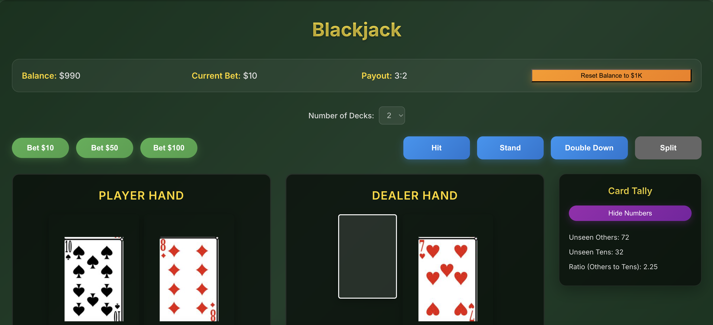

## Getting started 
Play on live site [here](https://alscotty.github.io/blackjack_sim/)
- Goal to create a blackjack game - all html/react so I can later use Serenade AI to practice with voice commands only! Ex. say "Hit" or "Stand" to play the game
- Practice for myself on the Ten Count Strategy, founded by Ed Thorp, a genius mathmetician, blackjack player, and hedge fund manager on Wall Street



## Goals
- blackjack core gameplay [x]
    - doubling down allowed [x]
    - pair splitting allowed [x]
- player can modify # of decks [x]
- player can change bet size without losing extra $ in-between hands []
- add serenade shortcuts/scripts []
- displays running count, # unseen "others" vs # unseen 10's for Ten Count Strategy [x]
- get card images somewhere to use [x]
- option to toggle payout ratio, or just set to whatever is most common in Vegas tables [x]
- add test cases [x]
- refactor/clean up []

## Available Scripts

In the project directory, you can run:

### `npm start`

Runs the app in the development mode.\
Open [http://localhost:3000](http://localhost:3000) to view it in your browser.

The page will reload if you make edits.\
You will also see any lint errors in the console.

### `npm test`

Launches the test runner in interactive watch mode.\
See the section about [running tests](https://facebook.github.io/create-react-app/docs/running-tests) for more information.

### `npm test -- --watchAll=false`

Runs all tests once without watch mode. Useful for CI/CD pipelines.

### `npm run build`

Builds the app for production to the `build` folder.\
It correctly bundles React in production mode and optimizes the build for the best performance.

The build is minified and the filenames include the hashes.\
Your app is ready to be deployed!

### `npm run deploy`

Builds the app and deploys it to GitHub Pages.

## Testing

The project includes comprehensive test coverage for core game functionality:

- **Core Game Logic** (`src/game/blackjackLogic.test.js`): Tests for hand value calculations, ace handling, deck creation, and shuffling
- **Game Outcomes** (`src/game/gameLogic.test.js`): Tests for win/loss/push scenarios, payout calculations, split logic, and dealer behavior
- **Component Tests** (`src/components/GameTable.test.js`): Tests for UI interactions, betting, game actions, and state management
- **App Tests** (`src/App.test.js`): Basic app rendering tests

Run all tests:
```bash
npm test -- --watchAll=false
```

Run tests in watch mode (for development):
```bash
npm test
```
